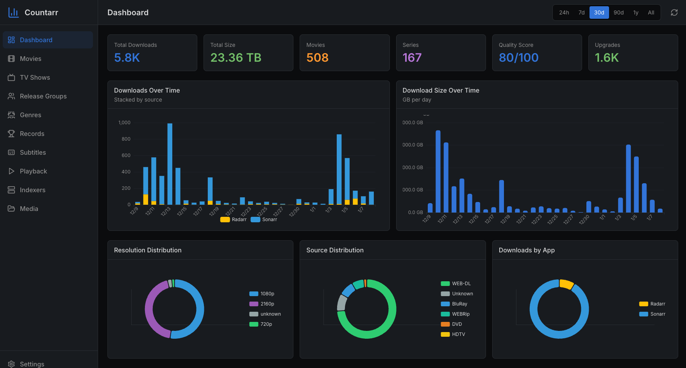

# Countarr

A beautiful, Grafana-inspired statistics dashboard for your media server stack. Track downloads, quality upgrades, playback activity, and more from Radarr, Sonarr, Bazarr, Prowlarr, Jellyseerr, and Emby/Jellyfin.



## Features

### Download Statistics
- Total downloads over time (by app)
- Download volume (GB per day)
- Activity heatmap (by hour and day of week)
- Downloads by source app distribution

### Quality Analytics
- Resolution distribution (480p, 720p, 1080p, 4K)
- Source distribution (BluRay, WEB-DL, HDTV, etc.)
- Codec distribution (x264, x265, AV1)
- Quality score trends over time
- Quality upgrade flow (Sankey diagram)

### Release Group Tracking
- Top release groups by count and size
- Favorite release groups monitoring
- Release group loyalty percentage

### Upgrade Tracking
- Upgrades per day
- Most upgraded items
- Average time between upgrades
- Full upgrade path visualization per item

### Playback Statistics (Emby/Jellyfin)
- Watch time over time
- Most watched content
- Watched vs unwatched ratio
- "Shame list" - downloaded but never watched

### Indexer Performance (Prowlarr)
- Success rates per indexer
- Response time trends
- Downloads by indexer distribution

### Records & Extremes
- Biggest file ever downloaded
- Most upgraded item
- Busiest download day
- Longest upgrade wait

## Quick Start

### Docker Compose (Recommended)

1. Start the container:

```bash
cd docker
docker-compose up -d
```

2. Access the dashboard at `http://localhost:7474`

3. Follow the on-screen setup wizard to connect your services

### Manual Installation

1. Clone the repository:

```bash
git clone https://github.com/khchop/countarr.git
cd countarr
```

2. Install dependencies:

```bash
pnpm install
```

3. Start development server:

```bash
pnpm dev
```

4. For production:

```bash
pnpm build
pnpm start
```

5. Open `http://localhost:7474` and follow the setup wizard

## Configuration

### Service Connections

All service connections (Radarr, Sonarr, etc.) are configured through the web interface:

1. On first launch, the setup wizard will guide you through connecting your first service
2. To add more services later, go to **Settings** in the sidebar
3. Click **Add Connection** and enter:
   - Service type (Radarr, Sonarr, etc.)
   - Connection name
   - URL (e.g., `http://localhost:7878`)
   - API key

Each connection is tested before saving to ensure it works correctly.

### Environment Variables

Only minimal server configuration uses environment variables:

| Variable | Description | Default |
|----------|-------------|---------|
| `PORT` | Server port | `7474` |
| `DATABASE_PATH` | SQLite database path | `./data/countarr.db` |

### Getting API Keys

- **Radarr/Sonarr/Prowlarr**: Settings > General > Security > API Key
- **Bazarr**: Settings > General > Security > API Key
- **Jellyseerr**: Settings > General > API Key
- **Emby**: Dashboard > API Keys > New API Key
- **Jellyfin**: Dashboard > API Keys > Add API Key

## Tech Stack

- **Backend**: Node.js, Fastify, TypeScript
- **Frontend**: React, Vite, TailwindCSS
- **Database**: SQLite with Drizzle ORM
- **Charts**: Apache ECharts
- **State Management**: TanStack Query, Zustand

## Project Structure

```
countarr/
├── docker/              # Docker configuration
├── packages/
│   ├── server/          # Backend API
│   │   ├── src/
│   │   │   ├── api/     # Fastify routes
│   │   │   ├── clients/ # *arr API clients
│   │   │   ├── collectors/ # Data sync
│   │   │   ├── db/      # Database schema
│   │   │   ├── stats/   # Stat calculators
│   │   │   └── scheduler/ # Polling jobs
│   ├── web/             # Frontend
│   │   └── src/
│   │       ├── components/ # React components
│   │       ├── pages/   # Page components
│   │       └── hooks/   # Custom hooks
│   └── shared/          # Shared types
├── .env.example
└── package.json
```

## API Endpoints

### Stats
- `GET /api/stats/overview` - Overview statistics
- `GET /api/stats/downloads` - Download statistics
- `GET /api/stats/quality` - Quality analytics
- `GET /api/stats/release-groups` - Release group stats
- `GET /api/stats/upgrades` - Upgrade statistics
- `GET /api/stats/playback` - Playback statistics
- `GET /api/stats/indexers` - Indexer performance
- `GET /api/stats/records` - Records and extremes

### Media
- `GET /api/media` - List media items
- `GET /api/media/:id` - Get media item with upgrade path
- `GET /api/media/:id/history` - Get download history

### Settings
- `GET /api/settings` - Get settings
- `PATCH /api/settings` - Update settings
- `POST /api/settings/sync` - Trigger manual sync

### Connections
- `GET /api/connections` - List all connections
- `GET /api/connections/status` - Get connection summary
- `POST /api/connections` - Add a new connection
- `PATCH /api/connections/:id` - Update a connection
- `DELETE /api/connections/:id` - Remove a connection
- `POST /api/connections/:id/test` - Test a connection
- `POST /api/connections/test` - Test connection before saving

## License

MIT
